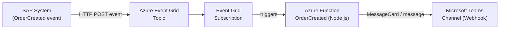

# sap-azure-eventgrid-demo

End-to-end demo showing how SAP emits `OrderCreated` events, Azure Event Grid routes them to an Azure Function, and the Function posts a formatted message to a Microsoft Teams channel.

---

## Architecture



**Flow:**
1. An SAP system (or any HTTP client) publishes an `OrderCreated` CloudEvent / Event Grid event to the Azure Event Grid Topic endpoint.
2. Event Grid routes the event to the registered subscription, which points to the Azure Function HTTP endpoint.
3. The Azure Function (`src/OrderCreated`) validates the event, builds a rich text message, and posts it to a Microsoft Teams channel using an incoming webhook URL.

---

## Repository Structure

```
.
├── README.md
├── local.settings.json.example   # Copy to local.settings.json for local testing
├── src/
│   ├── host.json
│   ├── package.json
│   └── OrderCreated/
│       ├── function.json         # Event Grid trigger binding
│       └── index.js              # Function implementation
└── terraform/
    ├── main.tf                   # All Azure resources
    ├── variables.tf              # Input variables
    └── outputs.tf                # Output values
```

---

## Prerequisites

- [Azure CLI](https://learn.microsoft.com/en-us/cli/azure/install-azure-cli) ≥ 2.50
- [Terraform](https://developer.hashicorp.com/terraform/downloads) ≥ 1.5
- [Node.js](https://nodejs.org/) 18 LTS
- [Azure Functions Core Tools](https://learn.microsoft.com/en-us/azure/azure-functions/functions-run-local) v4
- An Azure subscription
- A Microsoft Teams channel with an [incoming webhook](https://learn.microsoft.com/en-us/microsoftteams/platform/webhooks-and-connectors/how-to/add-incoming-webhook) configured

---

## 1 – Configure a Teams Incoming Webhook

1. In Teams, open the channel you want to receive notifications in.
2. Click **···** (more options) → **Connectors** → **Incoming Webhook** → **Configure**.
3. Give the webhook a name (e.g. `SAP Orders`) and click **Create**.
4. Copy the generated webhook URL – you will need it in the steps below.

---

## 2 – Deploy Infrastructure with Terraform

```bash
cd terraform

# Initialise providers
terraform init

# Review the plan (adjust variables as needed)
terraform plan \
  -var="resource_group_name=rg-sap-eventgrid-demo" \
  -var="location=westeurope" \
  -var="teams_webhook_url=https://outlook.office.com/webhook/..."

# Apply
terraform apply \
  -var="resource_group_name=rg-sap-eventgrid-demo" \
  -var="location=westeurope" \
  -var="teams_webhook_url=https://outlook.office.com/webhook/..."
```

Terraform creates:
| Resource | Purpose |
|---|---|
| Resource Group | Container for all resources |
| Storage Account | Required by the Function App runtime |
| App Service Plan (Linux) | Consumption plan for the Function App |
| Linux Function App (Node.js 18) | Hosts the `OrderCreated` function |
| Event Grid Topic | Receives events from SAP |
| Event Grid Subscription | Routes events from the topic to the Function App |

After `terraform apply` finishes, note the output values:
- `event_grid_topic_endpoint` – the URL to which SAP publishes events
- `event_grid_topic_key` – the SAS key for the topic

---

## 3 – Deploy the Function Code

```bash
cd src

# Install dependencies
npm install

# Deploy to Azure (replace <FUNCTION_APP_NAME> with the Terraform output value)
func azure functionapp publish <FUNCTION_APP_NAME>
```

---

## 4 – Local Testing

```bash
cd src

# Copy the example settings
cp ../local.settings.json.example local.settings.json

# Edit local.settings.json and set TEAMS_WEBHOOK_URL
# Then start the function locally
npm install
func start
```

The function listens on `http://localhost:7071/runtime/webhooks/eventgrid?functionName=OrderCreated`.

---

## 5 – Simulate an OrderCreated Event

### Using `curl` (quickest)

```bash
TOPIC_ENDPOINT=$(terraform -chdir=terraform output -raw event_grid_topic_endpoint)
TOPIC_KEY=$(terraform -chdir=terraform output -raw event_grid_topic_key)

curl -X POST "$TOPIC_ENDPOINT/api/events" \
  -H "aeg-sas-key: $TOPIC_KEY" \
  -H "Content-Type: application/json" \
  -d '[{
    "id": "order-001",
    "subject": "Orders/order-001",
    "eventType": "OrderCreated",
    "eventTime": "'"$(date -u +%Y-%m-%dT%H:%M:%SZ)"'",
    "dataVersion": "1.0",
    "data": {
      "orderId": "order-001",
      "customerName": "Acme Corp",
      "amount": 4200.00,
      "currency": "EUR",
      "createdAt": "'"$(date -u +%Y-%m-%dT%H:%M:%SZ)"'",
      "sourceSystem": "SAP ERP"
    }
  }]'
```

### Using the Azure CLI

```bash
az eventgrid event-subscription show \
  --name func-order-created-sub \
  --source-resource-id $(terraform -chdir=terraform output -raw event_grid_topic_id)
```

To publish a test event via the CLI:

```bash
az eventgrid topic event-subscription create \
  --name test-cli-sub \
  --source-resource-id $(terraform -chdir=terraform output -raw event_grid_topic_id) \
  --endpoint-type webhook \
  --endpoint https://<FUNCTION_APP_NAME>.azurewebsites.net/runtime/webhooks/eventgrid?functionName=OrderCreated
```

---

## Environment Variables

| Variable | Description |
|---|---|
| `TEAMS_WEBHOOK_URL` | Incoming webhook URL for the Teams channel |
| `AzureWebJobsStorage` | Azure Storage connection string (set automatically by Terraform) |
| `FUNCTIONS_WORKER_RUNTIME` | Must be `node` |
| `WEBSITE_NODE_DEFAULT_VERSION` | Node.js version, e.g. `~18` |

---

## License

MIT
